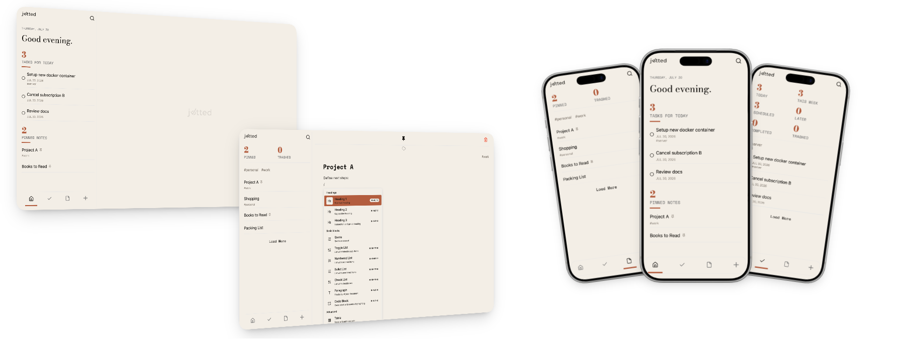

**One place for everything on your mind. Think it, jot it, keep it.**

***

The goal of jotted is to have a single self-hostable app that has all the information a user might be looking for, eliminating the need to have two separate apps. It tries to keep things simple and easy-to-use without compromising on features.

## Features

* Rich Text Editor with Markdown support and Slash menu ("/")
* Offline support
* Push Notifications for tasks
* Full text search
* Tags to organize notes and tasks
* PWA support (Progressive Web App)
* Dark mode
* Self-hosting first
* Single Docker container

## Tech Stack

* Next.js (React) - framework
* TypeScript
* Tailwind
* better-sqlite3 – database
* BlockNote – rich text editor
* Zustand – state management
* Serwist – PWA/service worker
* web-push – push notifications
* Radix UI
* node-cron - backend tasks scheduling
* Luxon – date/time handling

## Bugs & Issues

The app is new and under active development, and I don't have the ability to test on every device. So there are likely still bugs. Feel free to report any issues you run into, and I'll try to fix them as soon as possible.

## Quirks & Defaults

* Currently in order to activate the notifications, you have to enable them upon the first launch of the app on that client device. If you don't do that, you will have to remove and re-add the app on that device (aka delete cache & cookies for desktop/browser or remove and re-install PWA for mobile).
* Trashed notes & tasks will be completely deleted after 30 days in the trash (based on the last modified date).

All of these will be address in a later release and the user will be able to change the behavior in the future.

## Upcoming Features

Planned features and their progress can be seen in the [Projects](../../projects) section of this repo.

## Getting Started

### Docker Compose

```yaml
services:
    jotted:
        image: ghcr.io/g2kmedia/jotted:latest
        container_name: jotted
        ports:
            - "3000:3000"
        volumes:
            - /path/to/data:/app/data # location for DB and uploaded files
        restart: unless-stopped
```

### Development

#### Run development server

```bash
npm install
npm run dev
```

Runs the app at `http://localhost:3000`.

*Note*: `SerwistProvider` is set to `disable={process.env.NODE_ENV === "development"}` in `layout.tsx`, so the service worker (PWA/offline support) is disabled by default in dev mode.

To test the service worker locally, use:

```bash
npm run dev-serwist
```

This builds the service worker in watch mode alongside `next dev`. (*Note*: it will still be disabled unless you also adjust or remove the disable condition in `layout.tsx`.)

#### Testing on other devices (e.g. phone on the same network)

Add your local IP to `allowedDevOrigins` in `next.config.ts`, then access the app via `http://<your-local-ip>:3000`.

#### Building for production

```bash
npm run build
npm run start
```

This builds a standalone Next.js server (`output: "standalone"`) along with the Serwist service worker.

## Why I built it?
For many years now, I have been using some sort of note-taking solution to organize my day, plan things and keep track of important information. Throughout these years I've used Google Keep, Evernote, OneNote, Notion, Apple Notes, Apple Reminders, flatnotes and have tried out other solutions that I did not keep for a significant amount of time. All of these are great apps but I always found myself missing some features or thinking that the app had too many features that made it more complex than needed. 

In the end I wanted to have something that had a nice rich text editor, combined notes and reminders into one and had a good desktop browser as well as mobile experience.
